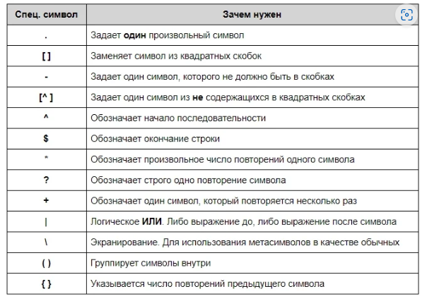

# Регулярные выражения

Регулярные выражения представляют мощный инструмент для обработки строк. Регулярные выражения позволяют задать шаблон, которому должна соответствовать строка или подстрока.
Регулярное выражение – это текстовый шаблон, используемый для поиска в тексте. Вы делаете это путем «сопоставления» его с текстом

**Ключевые классы**
Java RegExp обеспечиваются пакетом java.util.regex. Здесь ключевыми являются три класса:

Matcher — выполняет операцию сопоставления в результате интерпретации шаблона.
Pattern — предоставляет скомпилированное представление регулярного выражения.
PatternSyntaxException — предоставляет непроверенное исключение, что указывает на синтаксическую ошибку, допущенную в шаблоне RegEx.

Дополнительные команды для работы с регулярными выражениями:

\d — соответствует любой одной цифре и заменяет собой выражение [0-9];

\D — исключает все цифры и заменяет [^0-9];

\w — заменяет любую цифру, букву, а также знак нижнего подчёркивания;

\W — любой символ кроме латиницы, цифр или нижнего подчёркивания;

\s — поиск символов пробела;

\S — поиск любого непробельного символа.

? — делает символ необязательным, означает 0 или 1. То же самое, что и {0,1}.

* — 0 или более, {0,}.

+ — 1 или более, {1,}.

{n} — означает число в фигурных скобках.

{n,m} — не менее n и не более m раз.

*? — символ ? после квантификатора делает его ленивым, чтобы найти наименьшее количество совпадений.

Пример:

String s = "Это спецсимвол Java. \nОн означает перенос строки.";

System.out.println(s);

**split**

Для разделения строки на подстроки применяется метод split(). В качестве параметра он может принимать регулярное выражение, которое представляет критерий разделения строки.

    public static void main(String[] args) {
        String str1 = "Я знаю Джаву";
        String[] str = str1.split(" ");
        System.out.println(Arrays.toString(str));
    }
    
Вывод: [Я, знаю, Джаву]

**trim**

Удаляет пробелы вначале и конце строки

    public static void main(String[] args) {
        String str1 = " Я знаю Джаву ".trim();
        System.out.println(str1);
    }

**replaceFirst()**

Метод возвращает новую строку с первым совпадением регулярного выражения.

    public static void main(String[] args) {

        String text = "one two three one two";
        String subtext = text.replaceFirst("two", "five");
        
    }

**replaceAll()**

Метод возвращает новую строку со всеми совпадениями регулярного выражения.

    public static void main(String[] args) {

        String text = "one two three one two";
        String subtext = text.replaceAll("two", "five");

    }

**Matcher**

Основные методы класса Matcher:

boolean matches(): возвращает true, если вся строка совпадает с шаблоном

boolean find(): возвращает true, если в строке есть подстрока, которая совпадает с шаблоном, и переходит к этой подстроке

String group(): возвращает подстроку, которая совпала с шаблоном в результате вызова метода find. Если совпадение отсутствует, то метод генерирует исключение IllegalStateException.

int start(): возвращает индекс текущего совпадения

int end(): возвращает индекс следующего совпадения после текущего

String replaceAll(String str): заменяет все найденные совпадения подстрокой str и возвращает измененную строку с учетом замен

Пример:

    public static void main(String[] args) {

        String input = "Java";
        Pattern pattern = Pattern.compile("Java");
        Matcher matcher = pattern.matcher(input);
        boolean found = matcher.matches();
        if(found)
            System.out.println("Найдено");
        else
            System.out.println("Не найдено");
    }

**Pattern**

Pattern используется для создания шаблонов. Шаблон – это предварительно скомпилированное регулярное выражение в форме объекта (как экземпляр шаблона), способное сопоставляться с текстом.

    public static void main(String[] args) {

        String text    =" http:// url.";
        String regex = ".*http://.*";
        boolean matches = Pattern.matches(regex, text);
        System.out.println("matches = " + matches);
    }

